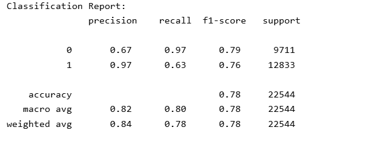
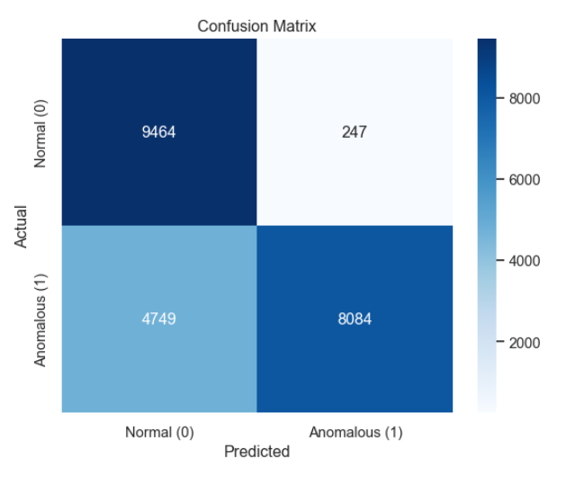
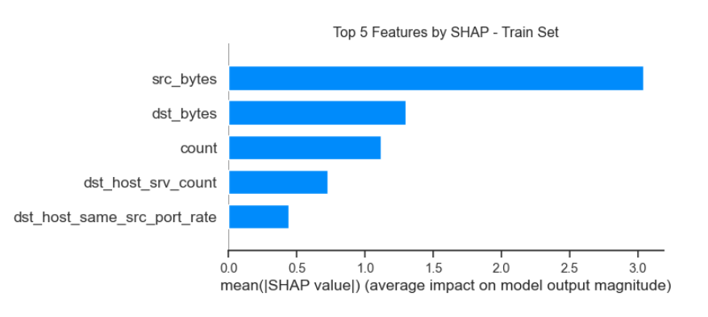
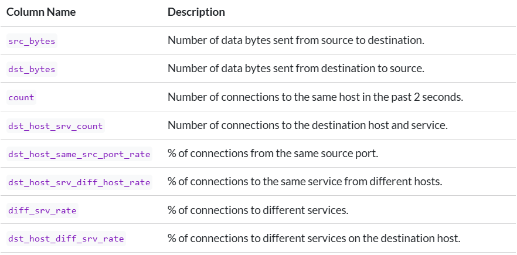

```{python}
#| label: load-packages
#| include: false

# Load packages here
import pandas as pd
import seaborn as sns

```


## The Problem

**What are we solving?**  
<span style="font-size: 35px;">Can we detect anomalous network traffic using supervised and unsupervised machine learning?</span>

::::: columns
::: {.column width="70%"}
**Why does it matter?**  
<span style="font-size: 35px;">
- Network attacks are increasingly sophisticated and harder to detect  
- Faster, more accurate anomaly detection strengthens cybersecurity  
- Comparing supervised vs. unsupervised methods reveals complementary insights  
</span>
:::
:::::

## The Data

- **Source:** <span style="font-size: 35px;">NSL-KDD Intrusion Detection Dataset (Kaggle)</span>  
- **Size:** <span style="font-size: 35px;">125,972 training rows · 22,543 testing rows · 43 features</span>  
- **Key Features Used:** <span style="font-size: 30px;">
  - src_bytes, dst_bytes (traffic volume)  
  - same_srv_rate, diff_srv_rate (service diversity e.g., HTTP, FTP, Telnet)  
  - count, dst_host_srv_count (connection counts)  
  - logged_in, flag_SF (status indicators)  
  - service_http, service_private (protocol dummies)  
</span> 

## Target Engineering

<span style="font-size: 32px;">
- Original dataset contained **multiple attack types**  
- Collapsed into a binary column: **is_anomalous**  
  - 0 = normal traffic, 1 = attack (any type)  
- Provides a clear target for supervised and unsupervised learning
</span>

::::: columns
::: {.column width="50%"}
{fig-align="center" width="100%"}
:::
::: {.column width="50%"}
{fig-align="center" width="100%"}
:::
:::::

## EDA and Preprocessing

<span style="font-size: 32px;"> 
**Process to preapare features** 
</span>

{fig-align="center" width="70%"}

## Supervised Learning (XGBoost)

<span style="font-size: 32px;">
- Accuracy: ~78% · ROC AUC: 0.96 · F1: 0.76  
- Strong precision for anomalies: 0.97  
- Recall weaker for anomalies: 0.63 => some attacks missed  
- Conservative model: low false positives, higher false negatives
</span>

::::: columns
::: {.column width="47%"}
{fig-align="center" width="80%"}
:::
::: {.column width="53%"}
{fig-align="center" width="90%"}
:::
:::::

## Feature Importance (SHAP)

<span style="font-size: 32px;">
- SHAP explains how each feature contributes to predictions  
- Bars show average impact on model output  
  - `src_bytes` and `dst_bytes` → traffic volume dominates  
  - `count` → repeated connections are strong signals  
  - `dst_host_srv_count` and `dst_host_same_src_port_rate` → service-level patterns 
</span> 

{fig-align="center" width="70%"}

## Unsupervised Learning Modeling

<span style="font-size: 32px;">
- Models: **K-Means, DBSCAN, Gaussian Mixture (GMM)**  
- Goal: detect anomalies without labels  
- Evaluated with silhouette score + Adjusted Rand Index (ARI)  
- Results:  
  - K-Means → best cohesion (Silhouette = 0.414)  
  - DBSCAN → closest to ground truth (ARI = 0.242)  
  - GMM → moderate on both metrics  
- Overall weaker than supervised, but reveal useful structure
</span>

## Feature Importance

<span style="font-size: 32px;">
- Top drivers overlap with supervised:  
  - `src_bytes`, `dst_bytes` → traffic volume  
- Unsupervised also emphasizes service-level diversity:  
  - `dst_host_srv_diff_host_rate`  
  - `diff_srv_rate`  
  - `dst_host_diff_srv_rate`  
- Shows anomalies can also be detected by unusual service/connection patterns
</span>

## Comparing Top Features

{fig-align="center" width="60%"}

<span style="font-size: 32px;">
- Supervised (XGBoost + SHAP): traffic volume → `src_bytes`, `dst_bytes`  
- Unsupervised (K-Means, GMM): also capture service-level rates  
- Overlap = consistent signals across methods  
- Differences = clustering adds variation missed by supervised  
**Takeaway → Traffic volume dominates, but clustering reveals service-level patterns**
</span>


## Feature Definitions
<span style="font-size: 32px;">
To interpret the feature rankings, here’s what the column names mean.  
In this dataset, **service** refers to the network application protocol (e.g., HTTP, FTP, Telnet).
</span>

{fig-align="center" width="70%"}

## Summary

<span style="font-size: 32px;">
- **Supervised (XGBoost):** high precision, conservative, some anomalies missed  
- **Unsupervised (K-Means, GMM):** weaker overall, but reveal service-level patterns  
- **Feature overlap:** traffic volume (`src_bytes`, `dst_bytes`) consistently dominant across methods  
- **Shared insight:** traffic volume dominates across methods  
- **Takeaway:** hybrid approaches can boost resilience in anomaly detection  
</span>

