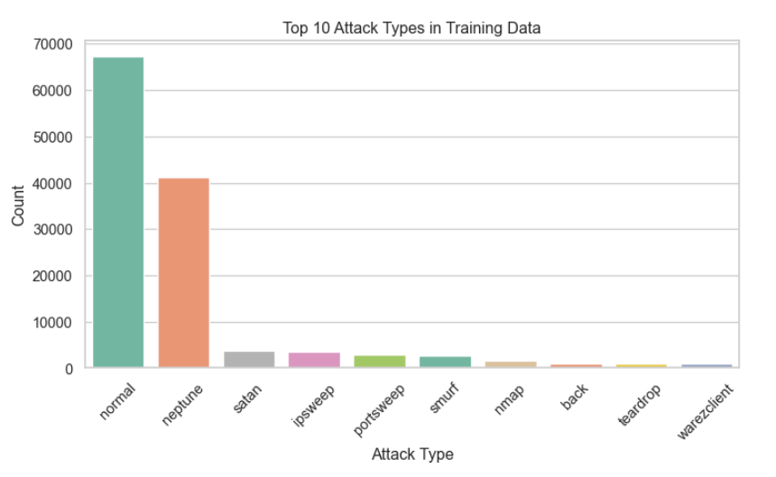
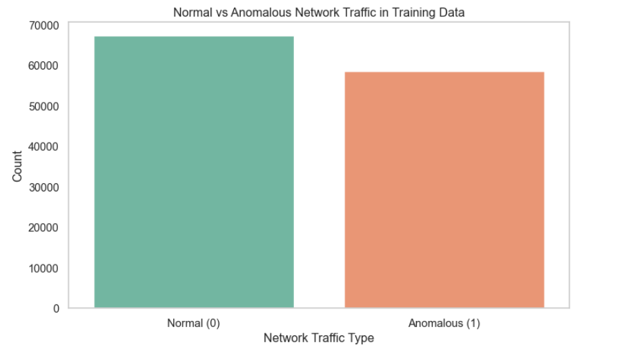
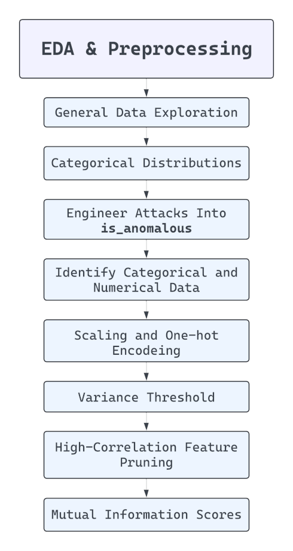
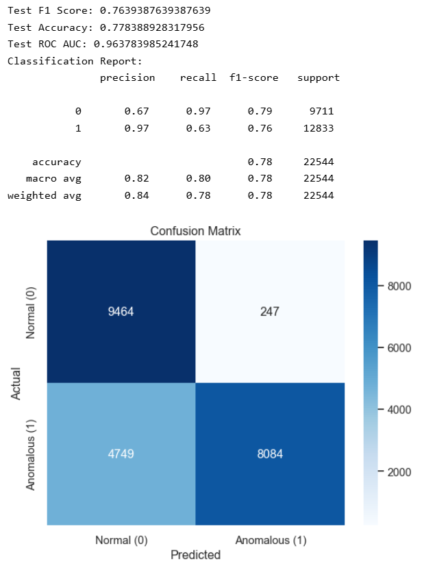
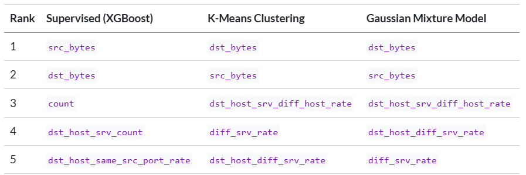

```{python}
#| label: load-packages
#| include: false

# Load packages here
import pandas as pd
import seaborn as sns

```

## The Problem

**What are we solving?**\
[Can we detect anomalous network traffic using supervised and unsupervised machine learning?]{style="font-size: 28px;"}

**Why does it matter?**\
[- Network attacks are increasingly sophisticated and harder to detect\
- Faster, more accurate anomaly detection strengthens cybersecurity\
- Comparing supervised vs. unsupervised methods reveals complementary insights\
]{style="font-size: 28px;"}

## The Data

-   **Source:** [NSL-KDD Intrusion Detection Dataset (Kaggle)]{style="font-size: 35px;"}\
-   **Size:** [125,972 training rows · 22,543 testing rows · 43 features]{style="font-size: 35px;"}\
-   **Key Features Used:** <span style="font-size: 30px;">
    -   src_bytes, dst_bytes (traffic volume)\
    -   same_srv_rate, diff_srv_rate (service diversity e.g., HTTP, FTP, Telnet)\
    -   count, dst_host_srv_count (connection counts)\
    -   logged_in, flag_SF (status indicators)\
    -   service_http, service_private (protocol dummies)\
        </span>

## Target Engineering

[- Original dataset contained **multiple attack types**\
- Collapsed into a binary column: **is_anomalous**\
- 0 = normal traffic, 1 = attack (any type)\
- Provides a clear target for supervised and unsupervised learning]{style="font-size: 32px;"}

::::: columns
::: {.column width="50%"}
{fig-align="center" width="100%"}
:::

::: {.column width="50%"}
{fig-align="center" width="100%"}
:::
:::::

## EDA and Preprocessing

[**Process to prepare features**]{style="font-size: 32px;"}

{fig-align="center" width="70%"}

## Supervised Learning (XGBoost)

::::: columns
::: {.column width="53%"}
[- **Recall weaker** for anomalies: 0.63 =\> some attacks missed\
- **Conservative model**: low false positives, higher false negatives\
**Training F1-score: \~99.81%**\
**Test F1-score: \~76%**\
- **Data Drift** implications from new cyber attack methods\
]{style="font-size: 28px;"}

[**Attack Types:**\
- Training contains 22\
- Testing contains 17 original + 21 new attacks\
]{style="font-size: 28px;"}
:::

::: {.column width="47%"}
{fig-align="center" width="90%"}
:::
:::::

## Unsupervised Learning Modeling

[**Models**: **K-Means, DBSCAN, Gaussian Mixture (GMM)**\
**Goal**: detect anomalies without labels\
**Evaluation Metrics**: silhouette score + Adjusted Rand Index (ARI)]{style="font-size: 24px;"}

::::: columns
::: {.column width="55%"}
[**Silhouette Scores:**\
- DBSCAN: 0.114\
- KMeans: 0.414 (Best cluster cohesion)\
- GMM: 0.307\
**Adjusted Rand Index:**\
- DBSCAN: 0.242 (Best at matching true anomalies)\
- KMeans: 0.179\
- GMM: 0.143 (Moderate on both metrics)\
]{style="font-size: 22px;"}
:::

::: {.column width="45%"}
[**Conclusion**\
- Unsupervised models are less accurate than supervised methods\
- Insights may help uncover new threats and support proactive network defense]{style="font-size: 22px;"}
:::
:::::

## Comparing Top Features

{fig-align="center" width="60%"}

[**Methods:**\
- Supervised (XGBoost): SHAP values explain feature importance\
- Unsupervised (K-Means, GMM): analyzing variation of feature values across clusters centers\
**Takeaway:**\
- consistent features `src_bytes` and `dst_bytes`\
- different influential service-level rates\
- both are inluenced differently by varying service-level rates]{style="font-size: 24px;"}

## Summary

[**Supervised (XGBoost):** high f1-score and some anomalies missed (False positives)\
**Unsupervised (K-Means, GMM):** weaker overall, but reveal different service-level patterns\
\
**Takeaways:**\
- **Feature overlap:** traffic volume (`src_bytes`, `dst_bytes`) dominant across methods\
- **Data Drift:** F1-score highlights train (f1=\~99%) and test (f1=\~76%) performance metrics\
- **Effective Practices:** A well-rounded approach would be to use both unsupervised and supervised methods\
- **Continued Research:** As attackers evolve, models must adapt. Ongoing monitoring and retraining are essential to address data drift and maintain strong network defenses.]{style="font-size: 28px;"}